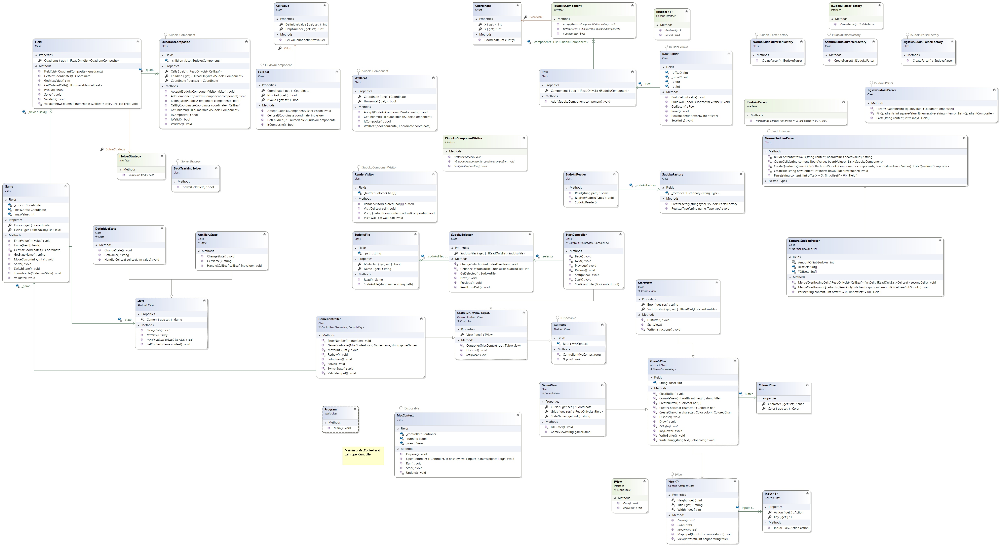

# Sudoku
An assignment by Avans Hogeschool.

## Contributors
- Haydar Pehlivan (2152143)
- Matthijs Kropholler (2152460)

## Implemented design patterns
- [Builder](https://refactoring.guru/design-patterns/builder)
- [Low binding factory method](https://refactoring.guru/design-patterns/factory-method)
- [Abstract factory](https://refactoring.guru/design-patterns/abstract-factory)
- [Composite](https://refactoring.guru/design-patterns/composite)
- [Visitor](https://refactoring.guru/design-patterns/visitor)
- [State](https://refactoring.guru/design-patterns/state)
- [Template method](https://refactoring.guru/design-patterns/template-method)
- [Strategy](https://refactoring.guru/design-patterns/strategy)

## Class diagram
